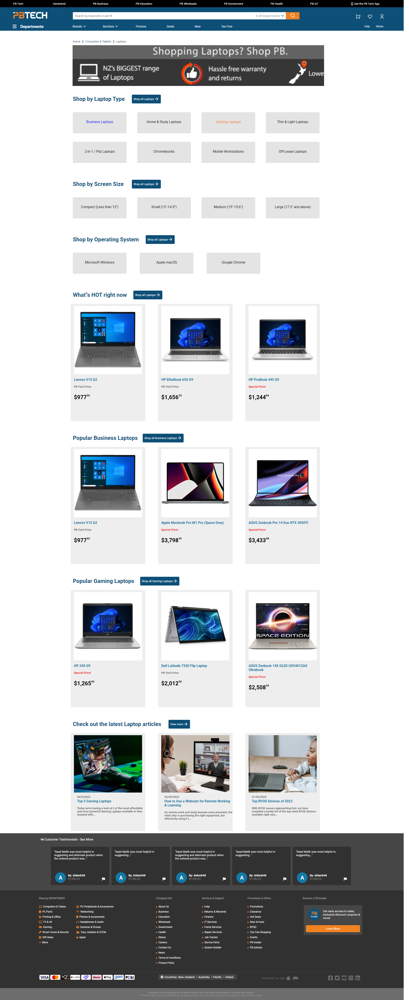
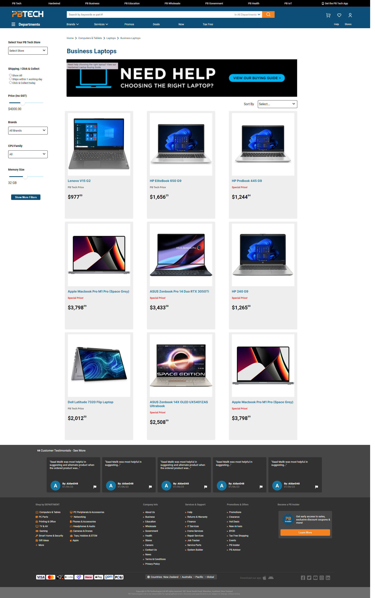
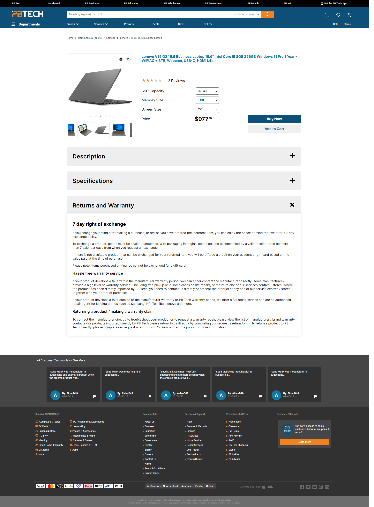

<!-- REFERENCES -->

[![Contributors][contributors-shield]][contributors-url]
[![Forks][forks-shield]][forks-url]
[![Stargazers][stars-shield]][stars-url]
[![Issues][issues-shield]][issues-url]

<!-- PROJECT LOGO -->
<br />
<div align="center">
  <a href="https://github.com/aubreybmina/mission-5.git">
    
  </a>

<h3 align="center">Mission 5 - PB Tech Laptop Page Re-design</h3>
<h4 align="center">Aubrey Mina and Wilhelmus Duncker<h4>

  <p align="center">  
    <a href="https://github.com/aubreybmina/mission-5"><strong>Explore the docs »</strong></a>
    <br />
    <br />
    <a href="https://github.com/aubreybmina/mission-5">View Demo</a>
    ·
    <a href="https://github.com/aubreybmina/mission-5/issues">Report Bug</a>
    ·
    <a href="https://github.com/aubreybmina/mission-5/issues">Request Feature</a>
  </p>
</div>

<!-- TABLE OF CONTENTS -->
<details>
  <summary>Table of Contents</summary>
  <ol>
    <li>
      <a href="#about-the-project">About The Project</a>
      <ul>
        <li><a href="#built-with">Built With</a></li>
      </ul>
    </li>
    <li>
      <a href="#getting-started">Getting Started</a>
      <ul>
        <li><a href="#prerequisites">Prerequisites</a></li>
        <li><a href="#installation">Installation</a></li>
      </ul>
    </li>
    <li><a href="#usage">Usage</a></li>
    <li><a href="#contributing">Contributing</a></li>
    <li><a href="#contact">Contact</a></li>
  </ol>
</details>

<!-- ABOUT THE PROJECT -->

## About The Project

&nbsp;&nbsp;&nbsp;&nbsp;&nbsp;&nbsp;

This PB Tech Laptop Landing Page Re-design project is part of our requirement for Mission Ready Level 5 Certification. As the developer, we were tasked to use MongoDB Compass as our database, create an API to talk to the db, and develop the UI that our UXD Team provided to display the collection from MongoDB. The working application was dockerized using Docker Compose.

### Built With

- [![MongoDB][mongodb.com]][MongoDB-url]
- [![Express][expressjs.com]][Express-url]
- [![React][React.js]][React-url]
- [![NodeJS][nodejs.org]][NodeJS-url]
- [![Sass][sass-lang.com]][Sass-url]
- [![Typescript][typescriptlang.org]][Typescript-url]

<p align="right">(<a href="#readme-top">back to top</a>)</p>

<!-- GETTING STARTED -->

## Getting Started

To get a local copy up and running, follow these simple example steps.

### Prerequisites

Make sure you have Node.js and MongoDB Compass installed in your computer. To check if you have it installed and see its version, type the following script in your Terminal

- Terminal
  ```sh
  node -v
  mongo -version
  ```

### Installation

1. Clone the repository

   ```sh
   git clone https://github.com/aubreybmina/mission-5.git
   ```

2. Create a .env file at the parent directory of api

   ```sh
   MONGO_URL = 'url of your mongodb compass working database'
   MONGO_URL_TEST = 'url of your mongodb compass test database'
   SERVER_PORT = 'desired port number, could be 9090'
   ```

3. Create a .env file at the parent directory of ui
   ```sh
   PORT = 'desired port number, could be 3001'
   ```
4. On your terminal, go to api folder then install the packages inside package.json using the following scripts

   ```sh
   npm install
   ```

5. Add a new terminal, go to ui folder then install the packages inside package.json using the following scripts
   ```sh
   npm install
   ```

<p align="right">(<a href="#readme-top">back to top</a>)</p>

<!-- USAGE -->

## Usage

To run the project on your local desktop run the following scripts:

1. On your terminal, go to api folder then start the db connection and the server

   ```sh
   cd api
   yarn dev
   ```

2. Add a new terminal, go to ui folder then run the ui. It will automatically open a browser tab
   ```sh
   cd ui
   yarn start
   ```

<!-- DOCKER -->

## Running the Docker Image

To create a docker image of the project on your local desktop run the following scripts:

1. On ui folder, change the proxy settings to http://api:9090".

   ```sh
   "proxy": "http://api:9090"
   ```

2. On your api's .env file, change MONGO_URL localhost to mongo

   ```sh
   MONGO_URL = 'mongodb://mongo:27017/db-name?'
   ```

3. Once everything is changed, you can finally run the docker script on the terminal of mission-5's parent directory
   ```sh
   docker-compose up
   ```

<!-- CONTRIBUTING -->

## Contributing

Contributions are what make the open source community such an amazing place to learn, inspire, and create. Any contributions you make are **greatly appreciated**.

If you have a suggestion that would make this better, please fork the repo and create a pull request. You can also simply open an issue with the tag "enhancement".
Don't forget to give the project a star! Thanks again!

1. Fork the Project
2. Create your Feature Branch (`git checkout -b feature/AmazingFeature`)
3. Commit your Changes (`git commit -m 'Add some AmazingFeature'`)
4. Push to the Branch (`git push origin feature/AmazingFeature`)
5. Open a Pull Request

<p align="right">(<a href="#readme-top">back to top</a>)</p>

<!-- CONTACT -->

## Contact

Aubrey Mina - aubreybmina@gmail.com
Wilhelmus Duncker - wimduncker17@hotmail.co.nz

Project Link: [https://github.com/aubreybmina/mission-5](https://github.com/aubreybmina/mission-5)

<p align="right">(<a href="#readme-top">back to top</a>)</p>

<!-- ACKNOWLEDGMENTS -->

## Acknowledgments

We would like to acknowledge our UXD Team, Mina Park and Jeremy Feng, for the awesome design they provided and for being patient with us as we code the project :)

<p align="right">(<a href="#readme-top">back to top</a>)</p>

<!-- MARKDOWN LINKS & IMAGES -->

[contributors-shield]: https://img.shields.io/github/contributors/aubreybmina/mission-5.svg?style=for-the-badge
[contributors-url]: https://github.com/aubreybmina/mission-5/graphs/contributors
[forks-shield]: https://img.shields.io/github/forks/aubreybmina/mission-5.svg?style=for-the-badge
[forks-url]: https://github.com/aubreybmina/mission-5/network/members
[stars-shield]: https://img.shields.io/github/stars/aubreybmina/mission-5.svg?style=for-the-badge
[stars-url]: https://github.com/aubreybmina/mission-5/stargazers
[issues-shield]: https://img.shields.io/github/issues/aubreybmina/mission-5.svg?style=for-the-badge
[issues-url]: https://github.com/aubreybmina/mission-5/issues
[product-screenshot]: src/images/screenshot.png
[React.js]: https://img.shields.io/badge/React-20232A?style=for-the-badge&logo=react&logoColor=61DAFB
[React-url]: https://reactjs.org/
[Sass-lang.com]: https://img.shields.io/badge/Sass-20232A?style=for-the-badge&logo=sass&logoColor=CF649A
[Sass-url]: https://sass-lang.com/
[typescriptlang.org]: https://img.shields.io/badge/Typescript-20232A?style=for-the-badge&logo=typescript&logoColor=3178C6
[Typescript-url]: https://www.typescriptlang.org/
[mongodb.com]: https://img.shields.io/badge/MongoDB-20232A?style=for-the-badge&logo=mongodb&logoColor=409937
[MongoDB-url]: https://www.typescriptlang.org/
[expressjs.com]: https://img.shields.io/badge/Express-20232A?style=for-the-badge&logo=express&logoColor=646464
[Express-url]: https://www.typescriptlang.org/
[nodejs.org]: https://img.shields.io/badge/NodeJS-20232A?style=for-the-badge&logo=node.js&logoColor=5AAB46
[NodeJS-url]: https://nodejs.org/en
